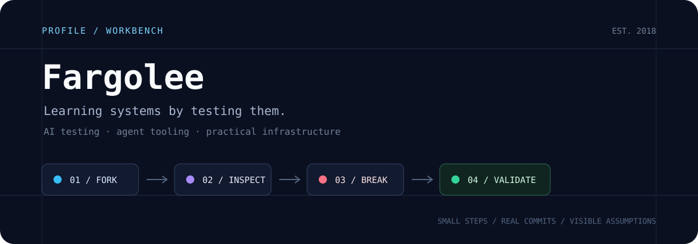

  

## What I work on

I explore AI testing, agent tooling, and infrastructure by forking repositories, running them in real environments, and documenting what breaks. My method: small PRs, visible assumptions, and commit-level proof instead of summary promises.

Recent focus areas:

- **AI-driven test automation** — investigating LLM-based test generation, bug reproduction workflows, and CI/CD integration patterns across platforms like WHartTest, AITestPlatform, and qaitest.
- **Agent-native software** — studying CLI-Anything, MCP server implementations, and composable tooling that makes existing software controllable by agents without bespoke integrations.
- **Infrastructure reality checks** — validating Docker-based deployments, proxy configurations, and cross-platform compatibility issues on Linux and macOS environments.

## How I work

- **Keep it small** — PRs should be reviewable without context loss. One clear change beats ten unrelated edits.
- **Document the why, not just the what** — assumptions decay faster than code. If a decision isn't obvious six months later, it wasn't captured properly.
- **Study forks like study notes** — I annotate, run, break, and rebuild. Passive reading doesn't surface the hidden dependencies.
- **Tools must be composable** — no monoliths, no magic globals. If it can't pipe input or expose a stable interface, it's technical debt.
- **Prefer clarity over cleverness** — if it can't be explained in a paragraph, it's too complex for production.

## Repository activity

<picture>
  <source media="(prefers-color-scheme: dark)" srcset="https://github-readme-stats.vercel.app/api?username=Fargolee&show_icons=true&hide_border=true&rank_icon=github&theme=tokyonight&bg_color=0b1020&title_color=7dd3fc&text_color=a9b7d0&icon_color=38bdf8">
  <source media="(prefers-color-scheme: light)" srcset="https://github-readme-stats.vercel.app/api?username=Fargolee&show_icons=true&hide_border=true&rank_icon=github&bg_color=f8fafc&title_color=0f172a&text_color=475569&icon_color=0ea5e9">
  
</picture>

<picture>
  <source media="(prefers-color-scheme: dark)" srcset="https://github-readme-stats.vercel.app/api/top-langs/?username=Fargolee&layout=compact&hide_border=true&theme=tokyonight&bg_color=0b1020&title_color=7dd3fc&text_color=a9b7d0">
  <source media="(prefers-color-scheme: light)" srcset="https://github-readme-stats.vercel.app/api/top-langs/?username=Fargolee&layout=compact&hide_border=true&bg_color=f8fafc&title_color=0f172a&text_color=475569">
  
</picture>

## Tech stack

**Languages:** Python · JavaScript · TypeScript · Shell

**Platforms:** Linux · macOS · Docker · Node.js · Git

**Testing focus:** Playwright · MCP servers · LLM-driven test generation · CI/CD pipelines

## Contact

- GitHub: [@Fargolee](https://github.com/Fargolee)
- Active repos: 104 · Followers: 5 · Following: 58

---

This profile is a workspace, not a showcase. If a fork looks abandoned, it's probably annotated locally.
